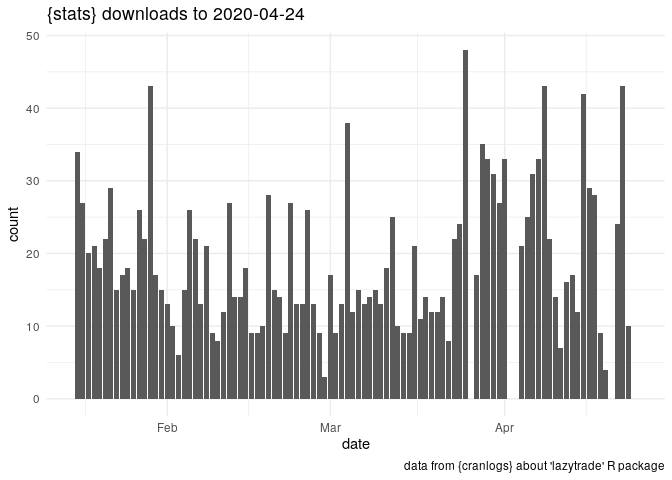

<!-- README.md is generated from README.Rmd. Please edit that file -->

# trackpack

<!-- badges: start -->

[](https://www.tidyverse.org/lifecycle/#experimental)
[](https://travis-ci.com/vladdsm/trackpack)
<!-- badges: end -->

The goal of trackpack is to track my package ‘lazytrade’

## Installation

You can install the released version of trackpack from
[CRAN](https://CRAN.R-project.org) with:

``` r
install.packages("trackpack")
```

## Example

This is a basic example which shows you how to solve a common problem:

``` r
library(trackpack)

## business logic code
library(ggplot2)
library(cranlogs)
stats <- cran_downloads("lazytrade", from = Sys.Date() - 100, to = Sys.Date() - 1) 
#sum(stats$count)


ggplot(stats, aes(date, count)) + 
  geom_col() + 
  labs(
    title = sprintf(
      "{stats} downloads to %s", 
      Sys.Date() - 1
      ), 
    caption = "data from {cranlogs}"
  ) + 
  theme_minimal()
```



What is special about using `README.Rmd` instead of just `README.md`?
You can include R chunks like so:

``` r
summary(cars)
#>      speed           dist       
#>  Min.   : 4.0   Min.   :  2.00  
#>  1st Qu.:12.0   1st Qu.: 26.00  
#>  Median :15.0   Median : 36.00  
#>  Mean   :15.4   Mean   : 42.98  
#>  3rd Qu.:19.0   3rd Qu.: 56.00  
#>  Max.   :25.0   Max.   :120.00
```

You’ll still need to render `README.Rmd` regularly, to keep `README.md`
up-to-date.

You can also embed plots, for example:


In that case, don’t forget to commit and push the resulting figure
files, so they display on GitHub\!
