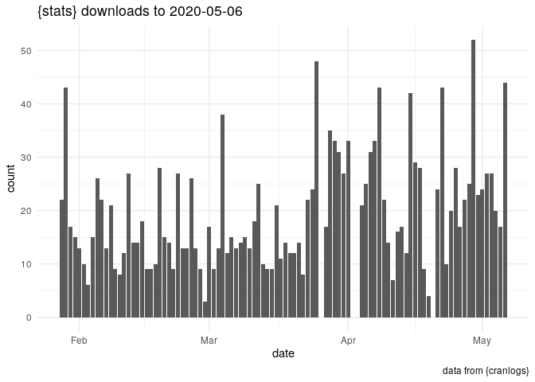

<!-- README.md is generated from README.Rmd. Please edit that file -->

# trackpack

<!-- badges: start -->

[](https://www.tidyverse.org/lifecycle/#experimental)
[](https://travis-ci.com/vladdsm/trackpack)
<!-- badges: end -->

The goal of trackpack is to track my package
[‘lazytrade’](https://cran.r-project.org/package=lazytrade)

## Goal of this Repository

This repository was created using *golem* framework for developing Shiny
App. Simple shiny app was developed as an R package.

## Installation

This repository will not be released on
[CRAN](https://CRAN.R-project.org). If it would, then it could be
installed with:

``` r
install.packages("trackpack")
```

However it is possible
to:

### Pull and launch ready to use Docker Container with Shiny App trackpack

1.  Install/launch Docker Desktop
2.  Run in the Terminal: `docker run -it --rm -p 80:80
    vladdsm/docker-trackpack`
3.  Launch Shiny App using `http://0.0.0.0`

Or, it is possible to fork or clone this repository and then:

### Build R package to launch App locally

1.  Open the trackpack.Rproj file
2.  Load and build the package
3.  Launch application by running the code `trackpack::run_app()`

### Build a Dockerfile and build Docker image locally

1.  Open script `'/dev/03_deploy.R'`
2.  Run code: `golem::add_dockerfile()` to build Dockerfile
3.  Build docker image in the terminal
4.  `cd '/usr/trackpack/'`
5.  `docker build -t vladdsm/docker-trackpack .` \[or use different
    image name\]
6.  Launch docker container with Shiny App (see above)

### Launch Docker container using docker-compose

Example of docker-compose.yml file is available in the repository
[compose-example](https://github.com/vladdsm/compose-example/tree/master/03-ExampleTrackPack)

1.  Clone code from the repository into the local folder
2.  Edit script `Run_Shiny_Trackpack` and replace local folder path.
    Well, also replace image name in case local image is available (see
    above how to build docker image locally)
3.  Launch script `Run_Shiny_Trackpack` (this will start container)
4.  Test ShinyApp in the browser `http://0.0.0.0`
5.  Stop container by launching `Stop_Shiny_Trackpack` or by executing
    `docker-compose down` in the Terminal

## App ‘business logic’

This is a basic core code that is used to solve a common problem:

``` r
## business logic code
library(ggplot2)
library(cranlogs)
stats <- cran_downloads("lazytrade", from = Sys.Date() - 100, to = Sys.Date() - 1) 
#sum(stats$count)


ggplot(stats, aes(date, count)) + 
  geom_col() + 
  labs(
    title = sprintf(
      "{stats} downloads to %s", 
      Sys.Date() - 1
      ), 
    caption = "data from {cranlogs}"
  ) + 
  theme_minimal()
```



## Continous Integration

Golem framework also containing ‘helper’ functions allowing to setup:

  - Version control in the repository
  - Use *travis ci* to test the package
  - Setup autobuilds on *Dockerhub*

This is creating possibility of ‘sustainable’ development. e.g. if new
feature is needed, then:

1.  Create branch dev\_feature1
2.  Implement changes, test locally
3.  Make a pull request
4.  Wait until the Travis test will be ok
5.  Join changes into Master Branch

Users may get a new version as soon as Docker autobuild will build
updated image

## Technical Comment

You’ll still need to render `README.Rmd` regularly, to keep `README.md`
up-to-date.

In that case, don’t forget to commit and push the resulting figure
files, so they display on GitHub\!

## Source

[thinkr blog](https://rtask.thinkr.fr/getting-started-with-golem/)
[golem
vignette](https://cran.r-project.org/web/packages/golem/vignettes/a_start.html)
